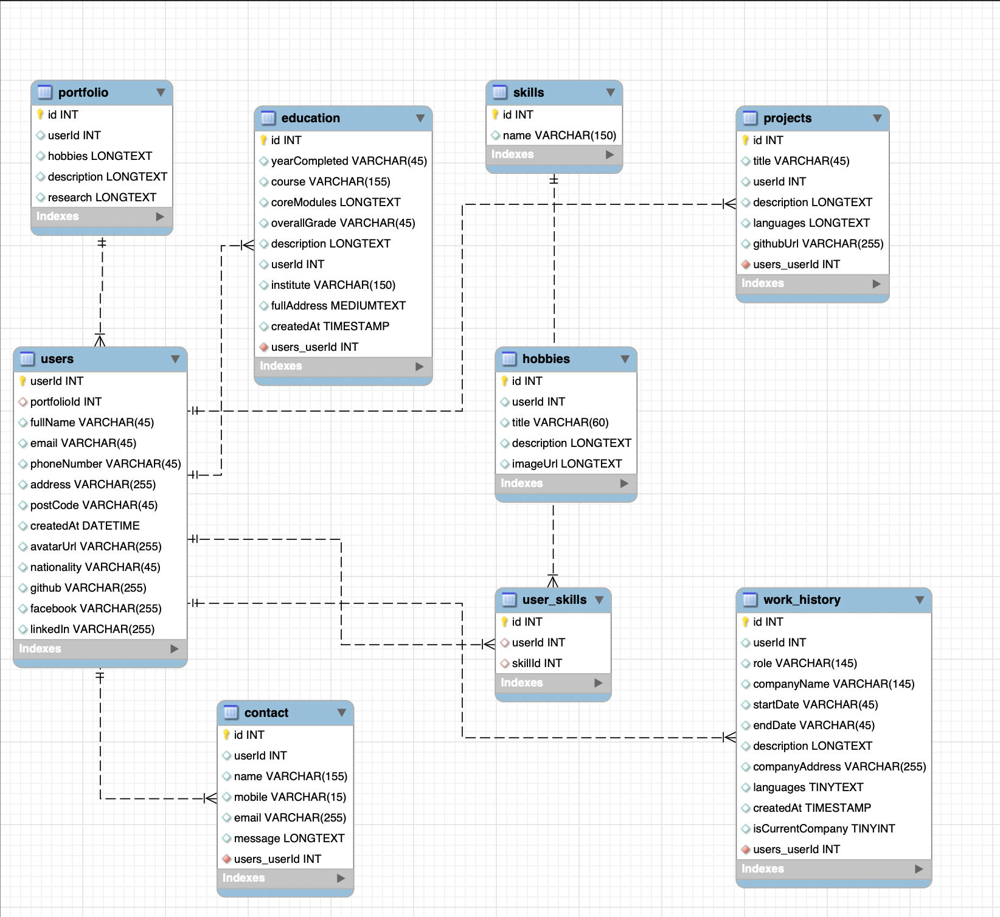

# SAM Backend

A SAM app build with **python** and **AWS Lambda**.

## Getting Started

Follow these steps to run the project locally:

1. Clone the repository:

   ```bash
   git clone https://github.com/mainaliashish/backend
   cd backend
   ```

2. Create a .env file inside layers/utils/python/.env and popluate the credentials

   ```bash
   DB_HOST="****"
   DB_PORT=****
   DB_USERNAME="****"
   DB_PASSWORD="*****"
   DB_NAME="****"
   REGION_NAME="****"
   ```

3. Be Sure that docker is running to build the containers.

4. Build using docker container

   ```bash
   sam build --use-container
   ```

5. Deploy SAM App

   ```bash
   sam deploy --guided
   ```

6. Once deployed to AWS, goto API Gateway and deploy the API

7. Update the config.json file inside frontend/services/config.json with new API endpoint
8. CORS are not mandatory for preflight request as I have only use simple GET/POST REST API headers
9. If you want PATCH/DELETE be sure to enable CORS in the REST API as the request are directly passed to lambda functions and appropriate headers are sent as a response from those lambda responses.

## ER Diagram for Portfolio Database


